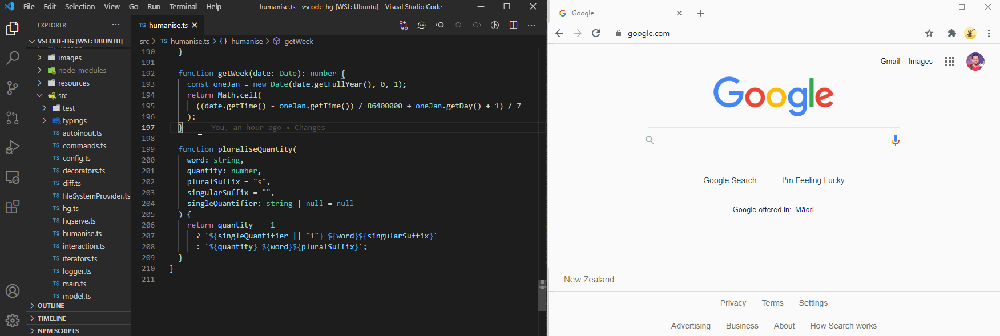

<h3 align="center">  </h3>

<h3 align="center">
  Get on the same page, <i>fast</i>
</h3>

  Share links to snippets that open directly in VS Code.

  

 

 

### Usage

## Snippets

Share links to snippets that open directly in VS Code.

#### How to Share a Snippet

1.  Select the code snippet you want to share.

2.  Press `Alt`+`Shift`+`S` (`Option`+`Shift`+`P` on macOS).

3.  The snippet URL link is automatically copied to your clipboard.

4.  Share the link (e.g. Slack) to anyone to have it highlight the snippet in their VS Code.

## Playbooks

But wait, there's more!

Snippets are shared via Playbooks, where you can plan out and think through code design problems with your team.

Playbooks can then be used to dynamically guide developers as they code, tightening the loop and keeping alignment between design discussions and implementation efforts.

#### Creating/Adding to a playbook

Let's get you adding your own code snippets to a new playbook!

1.  Select a snippet of code.

2.  Press `Cmd`+`Shift`+`P` to open the command palette and type `add to playbook`.  
    _Tip &mdash; press `Alt`+`P` (`Option`+`P` on macOS) as a shortcut for step 2._

3.  Follow the prompts to add your code snippet to a playbook.

#### Opening playbooks

1. Press `Cmd`+`Shift`+`P` to open the command palette and enter `open playbook`.

2. Select a playbook from the drop-down and it will open in your browser.

## Feedback

We'd love to hear from you: [feedback form 📋](https://jesse094360.typeform.com/to/sMmjdbVm)

# About Us

We are a small dev team from 🥝 **New Zealand** with a passion for the art of deving in teams!

Check out our team here: <a href="https://www.codelingo.io/about" target="_blank">codelingo.io/about</a>.
